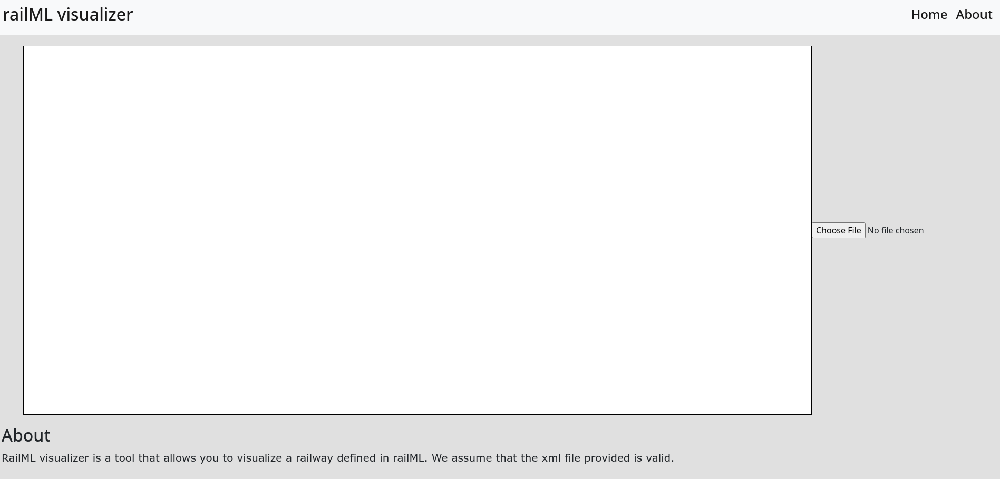
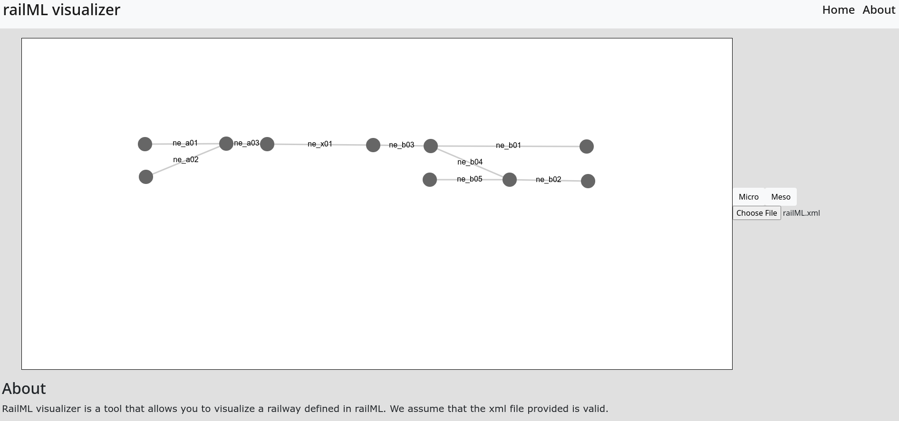
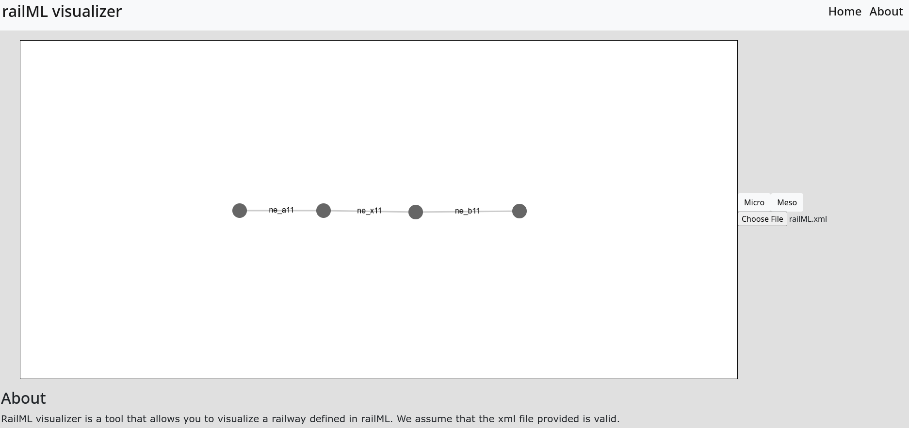

# railML visualizer

The railML visualizer, as the name indicates, is a tool that allows the user to display railML infrastructures.

## Usage

In order to use the visualizer tool, it is only needed to open the `index.html` in a browser and after that upload a `.xml`.

## Examples

Using [this](https://github.com/pedrordgs/RailML-Utilities/blob/master/examples/railML.xml) file, the expected outcome would be as depicted below.

Micro:

Meso:

