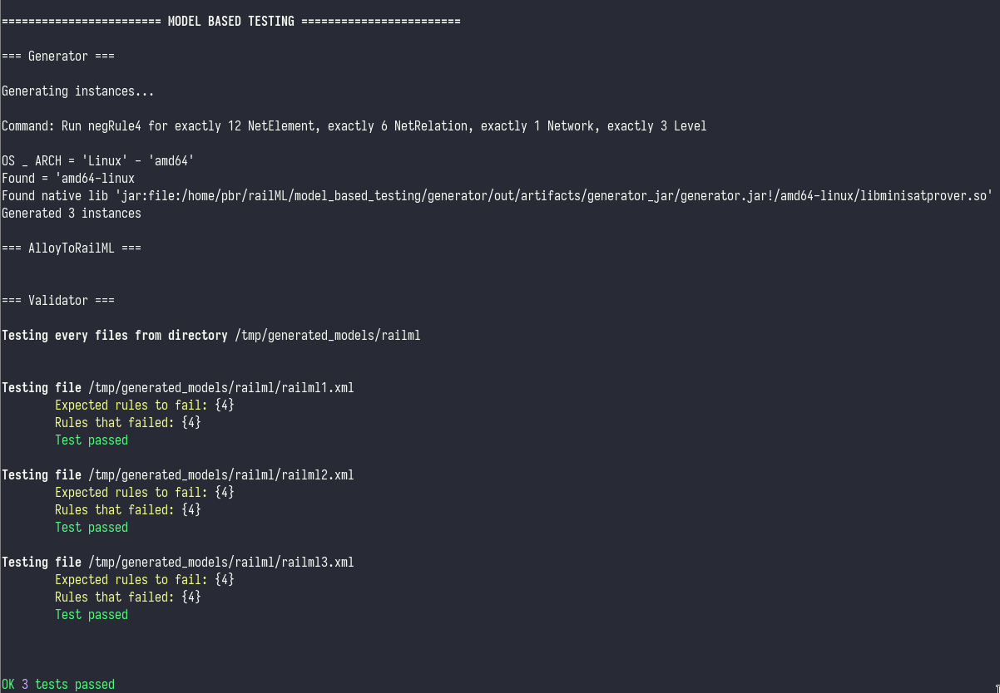
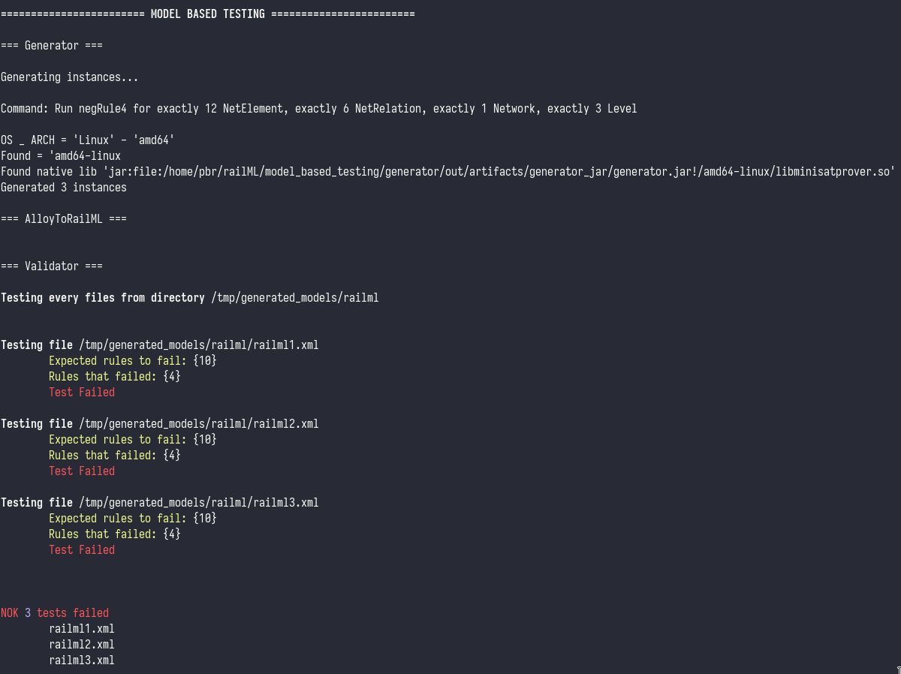

# Model Based Testing


The main goal of this model is to test both of our [validator](https://github.com/pedrordgs/RailML-Utilities/tree/master/validator) and [alloy related tools](https://github.com/pedrordgs/RailML-Utilities/tree/master/alloy_related). We used this model to check the consistency between our alloy model and validator. This has proven to be very useful for error and inconsistency detection allowing us to refine our tools and ensure the consistency we want on both alloy model and validator.

## Usage

The main file is `modelbased_test.py` and allow us to create check for *N* different railML instances that are created according to same alloy execution (*run*), if all this instances failed a certain list of rules (*failed*).

```bash
$ python modelbased_test.py [alloy_path] [run] [N] [failed]
```

##### Example

```
$ python modelbased_test.py ../alloy_related/topology.als negRule4 10 4
```

## Implementation

Like the name suggests, we compute tests on our application based on an [alloy model](https://github.com/pedrordgs/RailML-Utilities/blob/master/alloy_related/topology.als). In order to accomplish this, we use the alloy API, that can be found [here](https://alloytools.org/documentation/alloy-api/index.html), which allow us to automate the process of generating *N* instances of some *run* from some *alloy_path* file. After that, we use our tool [alloy2raiml](https://github.com/pedrordgs/RailML-Utilities/tree/master/alloy_related/alloyToRailML) in order to translate every created alloy instances to railML instances. To complete the process, we run our tool [test_validator](https://github.com/pedrordgs/RailML-Utilities/blob/master/validator/test_validator.py) in order to run the tests on every instances and check if the failed properties are the same as the given list of expected failed properties.

In order to run `alloy2railml` and `validator_rml` we created some bash scripts to help that can be found [here](https://github.com/pedrordgs/RailML-Utilities/tree/master/model_based_testing/helpers).

### Generator

This tools is a java program that has two variants:
* Create *N* instances of some *run*
* Generate one instances for each negRule run we have on our alloy model

The jar file can be found [here](https://github.com/pedrordgs/RailML-Utilities/tree/master/model_based_testing/generator/out/artifacts/generator_jar)

##### Usage

To create *N* instances of some *run* from an *alloy_path* file:

```
$ java -jar generator_jar [alloy_path] [run] [N]
```

This execution stores every created instances on `/tmp/generated_models/`.

To generate one instances for each negRule run:

```
$ java -jar generator_jar [alloy_path]
```

This execution creates a directory `generated_models` where it stores every created instances.


## Demo

`python modelbased_test.py ../alloy_related/topology.als negRule4 3 4`:



`python modelbased_test.py ../alloy_related/topology.als negRule4 3 10`:


